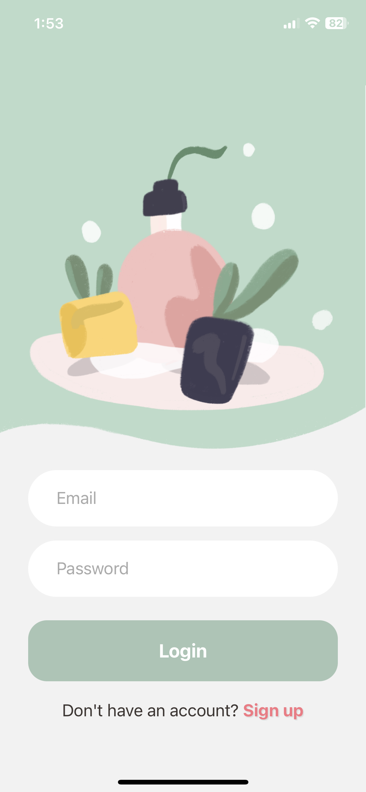

# Smol
### Skincare App - Your all-in-one skincare app to track acne, monitor reactions to skincare and food, and compare progress with others for clearer, healthier skin.




## Tech Stack
- React Native 
- Expo
- Firebase (Authentication, Firestore, Cloud Storage)

## Getting Started
1. Run command in terminal:
```
yarn install
npx expo
```

2. Open development server using `Expo Go` app in iOS.